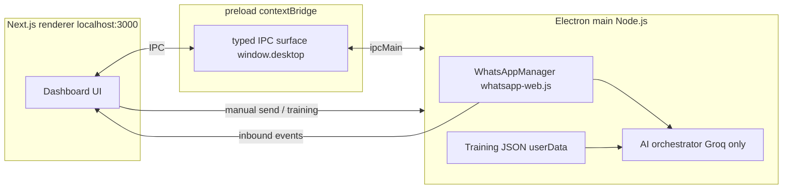

# WhatsApp AI Desktop

**Project root:** this folder only (`D:\whatsapp-ai-desktop` on your machine, or wherever you cloned it). Open it as the Cursor workspace — do not mix it with other apps or monorepos.

Modern **Electron + Next.js (App Router) + TypeScript + Tailwind** desktop app that connects to WhatsApp via **`whatsapp-web.js`**, keeps sessions **local-first**, and uses **OpenRouter** (one API key for chat + voice STT) for human-like replies. Legacy **xAI / Groq** direct keys remain optional. **Supabase** is wired minimally for optional auth/sync later.

> **Note:** `whatsapp-web.js` is unofficial and may violate WhatsApp Terms of Service. Use at your own risk, preferably with a dedicated business number.

## Client install (production)

**For paying customers** — no Node.js required:

1. Download the Windows installer from your vendor site (`/download`).
2. Install → open app → paste **license key** from email.
3. Setup → API keys → **OpenRouter** → Save + Test.
4. Connect WhatsApp → Training → Inbox (Draft queue recommended).

See **`docs/CLIENT-SETUP.md`** for the full five-step guide.

### Build the Windows installer (vendor)

```bat
cd /d D:\whatsapp-ai-desktop
npm install
set DESK_LICENSE_SERVER_URL=http://194.9.62.143:3025
set DESK_UPDATE_URL=https://yourdomain.com/release/
npm run dist:win
```

Output: `release/WhatsApp AI Desk-Setup-x.y.z.exe`. Host on your VPS — see **`DEPLOY-VPS.md`**.

### Marketing + billing server (VPS)

Deploy this Next.js app (standalone) on your server for pricing, Stripe checkout, license API, and Resend email. Copy **`.env.production.example`** and follow **`DEPLOY-VPS.md`**.

## Developer quick start

### Windows (CMD) — important

In **Command Prompt**, `cd D:\folder` does **not** switch drives. You must use **one** of these:

```bat
cd /d D:\whatsapp-ai-desktop
```

or:

```bat
D:
cd \whatsapp-ai-desktop
```

Do **not** paste lines starting with `#` into CMD (that is a comment in bash, but CMD treats `#` as a command).

### Main shell (MVP)

The dashboard uses a **top header** that stays visible after WhatsApp login:

- **Inbox** — conversations + chat + manual send / AI suggestion.
- **Connect** — QR, 8-digit pairing, session tools.
- **API keys** — **OpenRouter** (recommended: chat + voice STT with one key). Optional legacy xAI / Groq. Saved in Electron `userData` as `app-secrets.json`. Use **Save** then **Test** to verify live before Suggest reply.
- **Cloud API** — Meta fields stored for a future official HTTP path (chat still uses `whatsapp-web.js`).
- **Training** — business / FAQ bundle.

**Reply modes** (header): **Auto send** (default), **Paused** (no AI auto-send), **Draft queue** (AI reads each inbound message and queues a suggested reply in the bottom dock — nothing sends until you **Send to WhatsApp**; desktop notifications can remind you when a draft is ready). In **Draft queue**, the app also tries to write the same text into WhatsApp Web’s **per-chat compose buffer** (`setComposeContents` / `WAWebComposeBoxActions`, same idea as WPPConnect wa-js) so a draft may **sync to your phone** when Meta’s servers allow it — not guaranteed on every build. Disable with `WWEBJS_PHONE_DRAFT_SYNC=0`. Optional: `WWEBJS_COMPOSE_DRAFT_OPEN_CHAT=1` switches the active chat in the hidden Web view first (stronger UI update, more disruptive).

**Premium · Grok media** (inbox, per chat): optional **image** and **sticker-style** generation via xAI `images.generations`. The app tries `XAI_IMAGE_MODEL` first, then `XAI_IMAGE_MODEL_LIST` or built-in fallbacks (starting with `grok-imagine-image-quality`). Preview in the app, then **Send to this chat** as a normal image or WhatsApp sticker (`sendMediaAsSticker`). Gated for future paid tiers: tools unlock when the **desk admin session is unlocked** (correct PIN), or `DESK_GATE_DISABLED=1`, or `DESK_PREMIUM_MEDIA_UNLOCKED=1`. Force hide with `DESK_PREMIUM_MEDIA_LOCKED=1`.

**Languages:** English, Roman Urdu, Hindi (Devanagari), Arabic (RTL), and Spanish — strings live in `src/i18n/dictionaries/`. First launch picks a match from the browser/OS language when no saved choice exists; the header **Language** control persists to local storage.

### 1-click Desktop icon (recommended)

1. Open the project folder in Explorer: `D:\whatsapp-ai-desktop`
2. Double‑click **`Launch-WhatsApp-AI-Desktop.bat`** (first run auto-creates `.env` from `.env.example` if missing)
3. **Optional:** create a Desktop shortcut once:

```powershell
cd /d D:\whatsapp-ai-desktop
powershell -ExecutionPolicy Bypass -File .\scripts\Create-DesktopShortcut.ps1
```

This adds **“WhatsApp AI Desktop”** on your Desktop; it always uses the correct folder (`cd /d` is built into the `.bat`).

### Manual (Command Prompt)

```bat
cd /d D:\whatsapp-ai-desktop
copy /y .env.example .env
notepad .env
npm install
npm run dev
```

Git Bash / PowerShell: `Set-Location D:\whatsapp-ai-desktop` then the same `npm` commands.

What `npm run dev` does:

1. Builds the Electron main/preload bundle into `dist-electron/`.
2. Starts Next.js on `http://localhost:3000`.
3. Launches Electron pointed at that URL.

Scan the QR from the sidebar (or your terminal). After login, inbound messages trigger auto-replies unless **Manual takeover** is enabled.

## Environment variables

See `.env.example`:

- **`GROQ_API_KEY`** — chat replies and voice transcription (Whisper on Groq). Get a key at [console.groq.com](https://console.groq.com).
- **`NEXT_PUBLIC_SUPABASE_*`** — optional; `src/lib/supabase/client.ts` is ready when you add tables/policies.
- **Optional WhatsApp economy / typing simulation** (`WWEBJS_*` in `.env.example`) — see the comment block at the top of `electron/services/whatsapp-manager.ts` (defaults unchanged when unset).

## Architecture (high level)



**Why AI runs in the main process:** API keys never ship to Chromium. The renderer calls `window.desktop.ai.generateReply(...)` via IPC.

**Sessions:** `LocalAuth` stores WhatsApp session data under the Electron `userData` path (see `.gitignore` entries for `.wwebjs_*` patterns used by upstream tooling).

**Training:** `business-training.json` in `userData` (FAQ + business fields). Easy to mirror to Supabase later (`training` table + RLS).

## Folder structure

```
D:\whatsapp-ai-desktop
├── electron/
│   ├── main.ts                 # BrowserWindow + ipcMain
│   ├── preload.ts              # contextBridge API
│   ├── ipc-contract.ts         # shared IPC payload types
│   └── services/
│       ├── whatsapp-manager.ts
│       ├── ai-orchestrator.ts
│       └── training-store.ts
├── shared/
│   └── training.ts             # Zod schema + prompt projection
├── scripts/
│   └── build-electron.mjs      # esbuild bundle (packages: external)
├── src/
│   ├── app/                    # Next.js App Router
│   ├── components/
│   ├── hooks/
│   └── lib/
└── package.json
```

## Recommended packages (already selected or next steps)

| Area | Package | Notes |
|------|---------|------|
| Desktop shell | `electron`, `esbuild`, `concurrently`, `wait-on`, `cross-env` | Dev ergonomics |
| WhatsApp | `whatsapp-web.js` | Requires Chromium/Puppeteer; first launch downloads browser |
| AI | `groq-sdk`, `openai` (toFile helper only) | Groq chat + Groq Whisper |
| Validation | `zod` | Training bundle + future settings |
| Backend (optional) | `@supabase/supabase-js` | Auth + cloud sync |
| QR in UI | `qrcode` | Renders QR data URL in dashboard |
| Terminal QR | `qrcode-terminal` | Dev convenience in main process |

**Future additions (roadmap):**

- `better-sqlite3` or `duckdb` — richer local cache + analytics
- `bullmq` / `ioredis` — queued follow-ups (when you add a small worker)
- `@tanstack/react-virtual` — huge inbox virtualization
- `electron-updater` — auto-updates for SaaS distribution

## Implementation roadmap

### Phase 0 — Foundation (this repo)

- [x] Electron + Next dev loop
- [x] Typed preload bridge
- [x] WhatsApp connect + QR + `LocalAuth`
- [x] Auto-reply pipeline with typing delay
- [x] Groq-only chat + voice (Whisper on Groq)
- [x] Training JSON + prompt injection
- [x] Voice note download + Whisper transcription path
- [x] Dark SaaS-style inbox UI (starter)

### Phase 1 — Product hardening

- [ ] Encrypted local secret store for API keys (Windows Credential Manager / `keytar`)
- [ ] Per-account tone + automation rules persisted
- [ ] Read receipts / unread state model (not heuristic)
- [ ] Message dedupe + idempotency keys for outbound sends
- [ ] Structured logging + crash reports (Sentry optional)

### Phase 2 — Collaboration / SaaS-ready

- [ ] Supabase schema: `orgs`, `members`, `whatsapp_accounts`, `conversations`, `messages`, `training_docs`
- [ ] Team inbox assignment + mentions
- [ ] Subscription billing (Stripe) + entitlements

### Phase 3 — Advanced automation

- [ ] Follow-up scheduler (local worker + optional cloud queue)
- [ ] CRM sync (HubSpot/Pipedrive webhooks)
- [ ] Analytics funnel (conversion tags)

### Phase 4 — Future surfaces

- [ ] Browser extension sharing the same local API server
- [ ] Voice calling (separate provider + consent UX)

## WhatsApp + Puppeteer notes (Windows)

- First connect can take a while while Chromium downloads.
- If Puppeteer fails in CI/locked-down machines, you may need to adjust `puppeteer` executable path or OS policies.
- Voice notes: transcribed **automatically on arrival** (queued, up to 3 parallel). Install **ffmpeg** on PATH for best results (`ffmpeg -version`) — audio is normalized to 16 kHz WAV before **OpenRouter STT** (default `openai/whisper-large-v3-turbo`). Manual ↻ sync is only a retry fallback. Set `WWEBJS_DEV_LOG=1` to see download bytes and STT logs.

### OpenRouter setup (recommended)

1. Create a key at [openrouter.ai/keys](https://openrouter.ai/keys).
2. In the app: **Setup → API keys** → paste key → keep defaults or pick models from [openrouter.ai/models](https://openrouter.ai/models).
3. **Save API keys** → **Test API keys** — all required rows should be green.
4. Restart Electron if you changed code; keys apply immediately after Save.
5. Try **Suggest reply** on a voice note in Inbox.

Default models: chat `google/gemini-2.5-flash`, voice `openai/whisper-large-v3-turbo` (comma-separated = try in order).

## Scripts

| Script | Purpose |
|--------|---------|
| `npm run dev` | Next + Electron dev |
| `npm run build:electron` | Bundle `electron/` → `dist-electron/` |
| `npm run build` | Electron bundle + `next build` |
| `npm run dist:win` | Production Windows NSIS installer |
| `npm run prepare:standalone` | Copy Next standalone into `resources/` |
| `npm run lint` | Next ESLint |
| `npm run typecheck` | TypeScript (app + electron) |

## Security checklist (short)

- Never enable `nodeIntegration` in the renderer.
- Keep `contextIsolation: true` and a minimal preload.
- Treat all renderer input as untrusted before sending to WhatsApp or AI.
- Rotate API keys; prefer per-org keys when you add Supabase multi-tenant.

## License

Private / UNLICENSED unless you add a license file.
